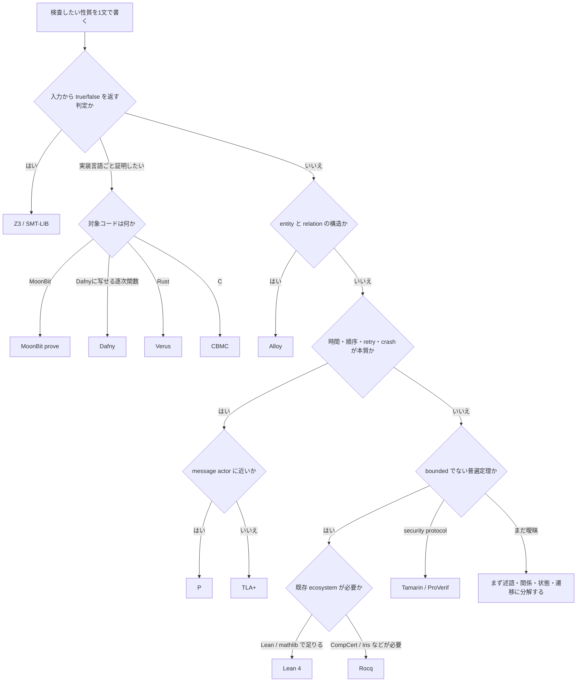
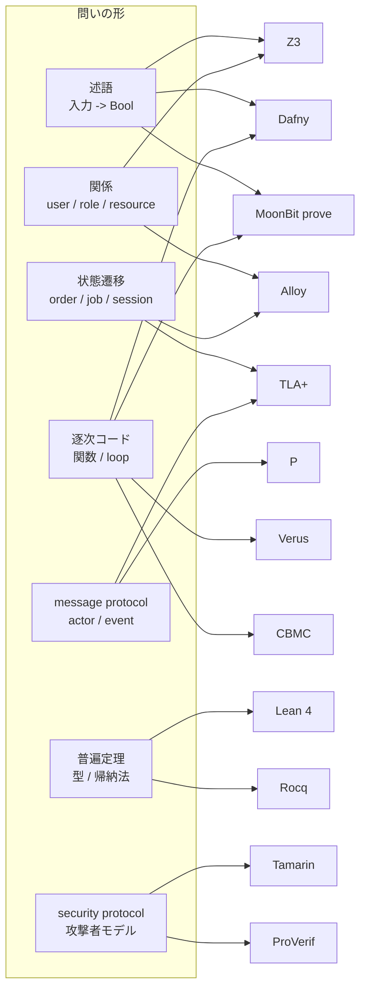
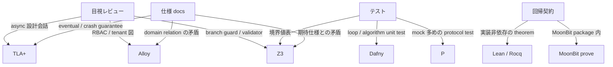

# ツールの得意不得意マップ

このページは、形式手法ツールを「言語名」ではなく **問いの形** から選ぶための早見表である。
後で skill 化するときは、この表を decision logic の土台にする。

## まず見る表

| ツール | 一番得意 | 苦手 | 反例の出方 | 実務での使いどころ |
| --- | --- | --- | --- | --- |
| Z3 / SMT-LIB | 入力に対する一瞬の判定、矛盾、等価性 | 時間、並行、liveness | `sat` と model witness | validator、feature flag、config、policy |
| Alloy | entity / relation / graph の小さい world 探索 | 長い時間、fairness、大規模 trace | 具体的な関係 instance | RBAC、tenant、ownership、workflow、network reachability |
| TLA+ | 状態遷移、全 interleaving、safety / liveness | 単純な述語検査、構造だけの関係モデル | action trace | retry、queue、outbox、crash recovery、distributed protocol |
| P | typed message を投げ合う actor / protocol | 数式、config 矛盾、汎用 theorem proving | event schedule と monitor violation | service 間 protocol、worker、device/controller、actor workflow |
| Dafny | 逐次コードの pre/postcondition と loop invariant | distributed protocol、既存 production code そのもの | failed obligation の位置 | parser、normalizer、pricing、business rule 関数 |
| MoonBit `moon prove` | MoonBit 実装の contract と proof-only model | model witness 取得、temporal interleaving | proof obligation failure | MoonBit library、validator、domain operation、data structure |
| Lean 4 | bounded でない普遍定理、型と帰納法 | 反例探索、現場 config の即時検査 | proof term / theorem | permission lattice、数学的 lemma、長寿命の仕様 |
| Rocq | 成熟 ecosystem を使う対話的証明 | 素早い bug hunting、domain owner 向け反例 | proof artifact | compiler、semantics、Iris、低レイヤ並行構造 |
| Why3 | VC generation と複数 prover backend | domain trace の可視化、protocol exploration | backend ごとの proof result | WhyML、MoonBit prove の backend、algorithm proof |
| Verus | Rust 形状の code contract | Rust 以外、自由な protocol model | verifier diagnostic | Rust module、ownership-sensitive invariant |
| CBMC | C の bounded execution path | unbounded proof、抽象 domain model | bounded trace | C / embedded の assertion、memory safety |
| Tamarin / ProVerif | symbolic security protocol | 一般アプリの業務ルール、UI、config | attack trace | key exchange、token protocol、認証 protocol |

## 選定フロー



## 対象領域マップ



## 置き換える作業から見る



## 近いが違うツール

| 迷う組み合わせ | 選び方 |
| --- | --- |
| Z3 vs Alloy | 入力 predicate なら Z3。user / role / resource の関係グラフなら Alloy |
| Alloy vs TLA+ | 構造の穴なら Alloy。順序や retry が bug を作るなら TLA+ |
| TLA+ vs P | 抽象的な状態遷移なら TLA+。machine / event / handler として実装に寄せたいなら P |
| Dafny vs MoonBit prove | Dafny に写せるなら Dafny。MoonBit 実装に contract を同居させるなら MoonBit prove |
| MoonBit prove vs Z3 | 実装契約を証明したいなら MoonBit prove。witness を出して仕様確認したいなら Z3 |
| Lean vs Rocq | 一般的な型・数学なら Lean。CompCert / Iris など Rocq 資産が必要なら Rocq |
| Tamarin vs ProVerif | security protocol の攻撃 trace を設計レビューで見たいなら Tamarin。自動検証寄りなら ProVerif |

## skill 化するときの入力

skill は次の順番で聞けばよい。

```text
1. 対象は docs / code / config / protocol / algorithm のどれか
2. 期待仕様はあるか、コードを de-facto 仕様として読むのか
3. 問いは述語、関係、状態、遷移、message、逐次コード、普遍定理のどれか
4. 反例が欲しいのか、契約として lock したいのか
5. domain owner に返す確認質問は何か
6. CI に残す最小コマンドは何か
```

この分類を先に行うと、Z3 で temporal protocol を無理に書いたり、
Lean で config bug を探したりする遠回りを避けられる。
