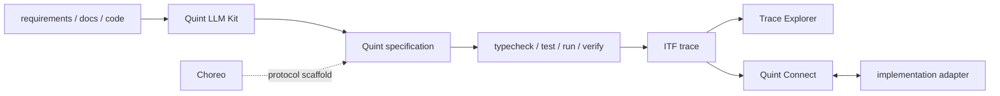

# Quint の周辺ツール: LLM Kit、Choreo、Connect、Trace Explorer

> Status: ecosystem survey, 2026-08-05
>
> Source of truth: Quint公式site、`quint-co` organizationの各repository、ITFの公式ADR

このsurveyをもとに公式2PCを実際に動かした結果は、
[Quint周辺ツールの実動評価](quint-ecosystem-evaluation.md)に分離した。

Quintは言語とmodel checker frontendだけで完結する道具ではない。周辺には、modelの作成、
distributed protocolの構造化、実装とのmodel-based testing、反例traceの読解を支援する
tool群がある。この文書では、それぞれがQuintのどの工程を拡張し、何を保証しないかを整理する。

## 先に結論

4つは競合する製品ではなく、同じQuint specificationを中心に異なる工程を担当する。

| tool | 工程 | 入力 | 主な成果物 | このrepoでの位置づけ |
| --- | --- | --- | --- | --- |
| Quint LLM Kit | model作成・変更 | requirements、docs、既存code、既存spec | `.qnt`、scenario test、実装計画 | 候補生成とverifier feedback loop |
| Choreo | distributed protocol設計 | node、message、local state、environment | 共通構造を持つQuint spec | consensus/RPC系のscaffold |
| Quint Connect | 実装conformance test | Quint traceとRust implementation、またはITF adapter | model-based test、state差分 | spec driftをCIで検出するbridge |
| Quint Trace Explorer | trace読解 | `.itf.json` | terminal上のstate差分表示 | 反例を人間が理解するdebug UI |

これらはQuint coreの検査保証を強くするものではない。Quint LLM KitとChoreoはmodelを
作りやすくし、Connectは有限個の生成traceを実装へreplayし、Trace Explorerは結果を
読みやすくする。型とeffectはQuintのtype checkerが検査し、propertyの反例探索とmodel checkは
simulator、TLC、Apalacheが担う。simulatorで反例が出なかったこと自体は網羅的な保証ではない。

## 全体像



共通の交換形式はITF（Informal Trace Format）である。ITFはstate machineの実行をJSONで表し、
QuintやApalacheに閉じないtool連携用の境界になる。

## Quint LLM Kit

[Quint LLM Kit](https://github.com/quint-co/quint-llm-kit)は、LLMにQuint modelの作成、検査、
変更、実装への反映を支援させるagent、command、MCP server、knowledge baseの集合である。

現在は2つの利用形態がある。

- Docker環境: Claude Code、Quint CLI、language server、Quint向けMCP serverをまとめて使う
- standalone skills: Claude Code、Codex、Cursor、Copilot、Gemini CLIなどへskillを導入する

workflowは大きく4段階に分かれる。

| command group | 役割 |
| --- | --- |
| `/spec:*` | docsやcodeからmodelを作る。distributed protocolならChoreoを準備する |
| `/verify:*` | witness生成、trace説明、type/message/listenerの到達可能性を調べる |
| `/code:*` | 安定したspecから実装計画を作り、modelのtransitionとcodeを対応づける |
| `/refactor:*` | requirements変更に合わせてmodelを更新し、再検査する |

重要なのは、LLMをcorrectness oracleにしないことである。

- LLMが作るのはcandidate modelとcandidate propertyである
- `quint typecheck`が通っても、domain requirementを正しく写したとは限らない
- invariantが通っても、modelが過度に制約されてbad behaviorを消している可能性がある
- safetyだけでなく、positive witnessとreachability testを必ず置く
- counterexampleはLLMの説明だけでなく、actionとstate差分を人間が確認する

公式READMEも、内部利用から発展したtoolであり、一般利用向けに十分評価・testされていないと
明記している。このrepoでは自動導入する基盤ではなく、Quintを書くagentのprompt、skill、
workflowを比較評価する実験対象として扱う。

## Choreo

[Choreo](https://github.com/quint-co/choreo)は、distributed protocolをQuintで書くための
frameworkである。code generatorではなく、`choreo.qnt`をimportし、既成の型とoperatorを
使ってprotocol固有logicを書くlibraryに近い。

plain Quintでprotocolを書くと、各modelで次を設計し直しやすい。

- message deliveryをqueue、channel、processごとのmailboxのどれで表すか
- process local stateとglobal environmentをどう分離するか
- timeout、message loss、network delay、Byzantine behaviorをどこへ置くか
- messageを受け取る条件と、その後のtransitionをどう分けるか

Choreoは次のpatternを提供する。

- **message soup**: network中のmessage集合として配送順序を非決定的に扱う
- **local/global分離**: `LocalContext`とglobal environmentをinterfaceで分ける
- **Transition + Effect**: localな`post_state`と`Broadcast`などのeffectを分離する
- **cue**: listen条件とact処理を分け、handler一覧とscenario testを読みやすくする
- **timeout as event**: 将来任意の時点で消費できるinternal eventとして表す
- **custom effect / extension**: evidence収集、accountability、database mockなどを拡張する
- **micro step**: messageを1件ずつ処理し、細かいstate差分を追う

Choreoが適するのは、2PC、consensus、replication、leader electionのようにprocess間通信の
scaffoldingがmodelの大半を占める場合である。単一application workflowの`OrderCheckout`には
plain Quintの方が小さい。

利用時は`main`のraw fileをそのままcurlするのではなく、commitをpinしてrepository内へvendorし、
Choreo側の更新とmodelの意味変更をreviewできるようにする。frameworkがenvironment semanticsを
担うため、version driftは単なるbuild問題ではなく、検査対象のtransition systemのdriftになる。

## Quint Connect

[Quint Connect](https://github.com/quint-co/quint-connect)は、Quint specificationから生成した
traceをRust実装へreplayするmodel-based testing libraryである。Quint modelをoracleとして、
各step後にproduction側から抽出したstateとspec stateを比較する。

導入時にRust側で定義するcontractは主に2つある。

1. `Driver::step`: Quintのaction名と引数を、実装の操作へ写す
2. `State::from_driver`: 実装stateを、比較対象のspec stateへ射影する

`#[quint_test]`はnamed scenarioを実行し、`#[quint_run]`は複数のsimulation traceを生成して
replayする。失敗時のseedを`QUINT_SEED`で再利用できる。action名と`nondet` choiceもtraceへ
保持されるため、`step`配下にanonymous actionを残さないことが実装接続上のcontractになる。

Connectが検出するのは、選ばれたtraceに対するobservable behaviorの不一致である。

- model checking済みspecであることと、Rust実装が証明済みであることは同じではない
- simulationのsample数やstep bound外の実行はtestされない
- `Driver::step`の対応ミスは、実装bugと同様に結果を歪める
- state projectionから落としたfieldやI/O effectは比較対象にならない
- concurrency、clock、network、failure injectionをどう再現するかはdriver設計に残る

したがってConnectはformal verificationの代替ではなく、specとimplementationのdriftをCIで
発見するregression guardである。公式libraryはRust向けなので、他言語ではITF consumerとadapterを
別途用意する必要がある。このrepositoryでは、その構成を
[MoonBit runtime adapter `mizchi/quint_connect`](https://github.com/mizchi/quint-connect-moonbit)として独立repoに実装した。MoonBitから
Quint processを起動し、`run` / named `test`、複数trace、seed、nested state / custom action path、
stateless replayまで確認している。公式Connectのattribute macro、derive / Serde、shrinkingは移植していない。

## TraceExporter と Quint Trace Explorer

2026-08-05時点で、公式organizationに`TraceExporter`という独立toolは確認できなかった。
公式に公開されている名称は
[Quint Trace Explorer](https://github.com/quint-co/quint-trace-explorer)である。

役割は次のように分かれる。

```text
trace export:
  quint run/test/verify ... --out-itf=trace.itf.json

trace exploration:
  quint-trace-explorer trace.itf.json
```

つまりexporterはQuint CLIの`--out-itf`機能で、Trace Explorerは生成済みITFを読むRust製TUIである。
前後のstateを移動し、変化しなかったsubtreeを畳み、変数filterやside-by-side表示で
counterexampleの差分を追える。`run`、`test`、`verify`のITFを読め、README上ではTLCの直接traceは
今後対応とされている。

Trace Explorerは検査器ではない。表示を閉じてもinvariantが証明されたことにはならず、表示上
見えないfieldが不要だとも限らない。また、公式README自身がtoy / vibe-coded projectと明記して
いるため、このrepoではdebug補助として使い、CIの合否やcanonical trace parserにはしない。

## どれから試すか

事前surveyでは次の順を想定した。

1. **ITF出力を固定する**: 既存`OrderCheckout.qnt`のnegative controlを`.itf.json`へ出す
2. **Trace Explorerを試す**: 現在のCLI traceよりdomain reviewが容易になるか確認する
3. **LLM Kitのworkflowを部分採用する**: positive witness、named action、trace説明のpromptを評価する
4. **Choreoの別probeを作る**: `OrderCheckout`を移植せず、小さな2PCまたはmailbox protocolで比較する
5. **ConnectはRust実装、または明示的なruntime adapterから試す**: driver/state projectionを含めて保守コストを測る

4つを一度に導入しない。最小probeごとに、便利になった工程、追加されたtrust boundary、
CI時間、modelと実装の対応コストを記録する。

実動評価では、共通題材としてChoreoの公式2PCを使い、ITF出力、Trace Explorer、Connectまでを
一度につないだ。その結果、Rust実装のspec driftをpositive/negative controlで識別できたConnectを
最優先に更新した。さらにMoonBit runtime adapterでもtrace生成からreplayまでと同じ識別力を確認した。詳細と再現commandは
[評価結果](quint-ecosystem-evaluation.md)を参照する。

## このrepositoryでの判断

Quintを「TLA+を型付きsyntaxで書くDSL」とだけ捉えるのは狭い。周辺toolを含めると、Quintは
次のlifecycleを1つのspecでつなぐことを狙っている。

```text
requirements -> executable spec -> model check -> human-readable trace
             -> model-based test -> implementation drift detection
```

これはQuintを個人的なfirst choiceにする理由を強める。ただし、source of truthはLLM Kitでも
Connectでもなく、review済みのQuint specとpropertyである。Choreoのenvironment、Connectのadapter、
ITF consumerは、それぞれversionと境界を明記する。

## Decision ledger

| 項目 | 記録 |
| --- | --- |
| source | Quint公式docs、`quint-co`各repository、Apalache ITF ADR |
| observation | 4 toolは生成、protocol scaffold、implementation test、trace UIという別工程を担当する |
| terminology | `TraceExporter`という独立toolではなく、CLIのITF exportとQuint Trace Explorerに分かれる |
| domain question | Quint specをdesign文書で終わらせず、実装とCIまでsource of truthとして運用するか |
| decision | core Quintを維持し、ITF/Trace Explorerから段階的に評価する |
| trust boundary | LLM生成model、Choreo version、Connect driver/state projection、ITF consumer |
| evaluation | 公式2PCによるviewer、Choreo、Rust MBTと、独立package `mizchi/quint_connect`によるOrderCheckout replayは[実動評価](quint-ecosystem-evaluation.md)で実施済み |

## References

- [Quint documentation](https://quint.sh/docs)
- [Quint FAQ: LLM Kit and model-based testing](https://quint.sh/faq)
- [Quint LLM Kit](https://github.com/quint-co/quint-llm-kit)
- [Quint LLM Kit workflow](https://github.com/quint-co/quint-llm-kit/blob/main/GET_STARTED.md)
- [Choreo documentation](https://quint.sh/docs/choreo)
- [Choreo repository](https://github.com/quint-co/choreo)
- [Quint Connect](https://github.com/quint-co/quint-connect)
- [Quint model-based testing](https://quint.sh/docs/model-based-testing)
- [Quint Trace Explorer](https://github.com/quint-co/quint-trace-explorer)
- [ADR-015: Informal Trace Format](https://apalache-mc.org/docs/adr/015adr-trace.html)
